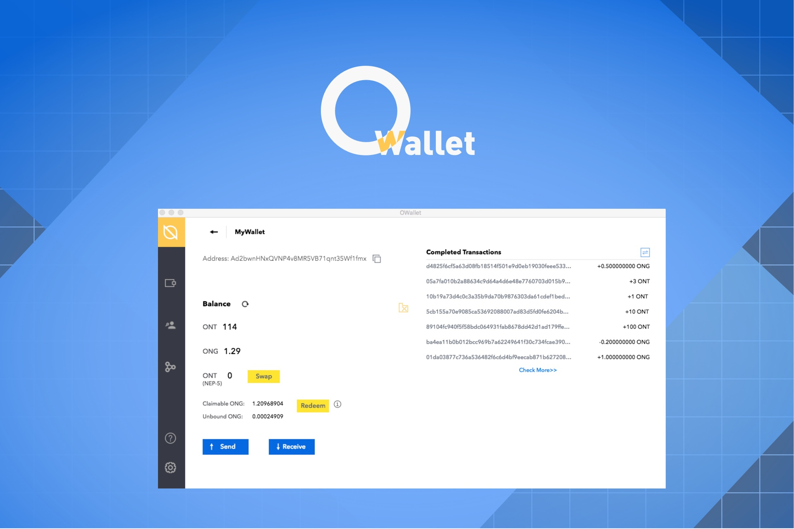

[中文版](./README_cn.md)


<h1 align="center">TWallet - a comprehensive TesraSupernet desktop wallet</h1>
<h4 align="center">Version 0.0.1</h4>

## Introduction

TWallet is a comprehensive TesraSupernet desktop wallet. TWallet supports standard wallet management, shared wallet management based on multi-signature technology, and will also connect with various hard wallets such as Ledger, Trezor, and so on. In the next phase, TWallet will integrate more applications, providing developers with smart contract compilation, invocation, and other comprehensive services.

Support Windows/MacOS/Linux,get it [Here](https://github.com/TesraSupernet/TersaWallet/releases)，also welcome to join.

Core features of TWallet are as follows:

* Create wallet/import wallet using keystore,mnemonic phrase,WIF private key,HEX private key 
* Support shared wallet based on multi-signature technology
* Ledger support
* View balance and record
* Send TSG and TST
* Withdraw (redeem) TSG
* Node stake and stake authorization management
* TST ID support
* Integrate gateway provided by changelly and cryptonex 




## Get started

1. Clone the repo

```
git clone https://github.com/TesraSupernet/TersaWallet.git
```

2. Install packages
**yarn** is recommended.
```
yarn install
```

3. Run in Development

```
yarn run dev
```

4. Build

```
yarn run package
```

> Do not use "npm run package" here, or the app will have problem in windows.

## Install released app

Please download the latest version that is compatiable with your platform.

## Default keystore.db file path

Default points to:

* %APPDATA% on `Windows`

* $XDG_CONFIG_HOME or ~/.config on `Linux`

* ~/Library/Application Support on `macOS`
